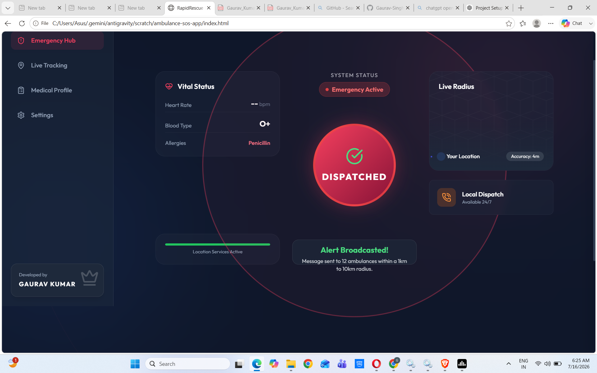

# 🚑 RapidRescue – Building Ambulance SOS App

<p align="center">
  <b>Smart Emergency Response Application with AI Assistance & Live Location Sharing</b>
</p>

<p align="center">
  
  
  
  
</p>

---

# 📖 About The Project

RapidRescue is a next-generation emergency ambulance response application designed to reduce emergency response time by connecting users with nearby ambulance services in just one tap.

The application allows users to instantly send an SOS request, share their real-time GPS location, communicate with emergency services, and receive AI-powered guidance during critical situations.

The long-term vision of RapidRescue is to build a smart emergency ecosystem connecting patients, ambulances, hospitals, and emergency responders through a single platform.

---

# ✨ Key Features

✅ One-Tap SOS Emergency Button

✅ Live GPS Location Sharing

✅ Nearby Ambulance Detection

✅ AI Emergency Assistant (24×7)

✅ Nearby Hospitals Information

✅ User Authentication

✅ Modern Responsive UI

✅ Android & iOS Support

✅ Fast Emergency Request System

---

# 🛠 Tech Stack

| Technology | Usage |
|------------|-------|
| HTML5 | Structure |
| CSS3 | Styling |
| JavaScript | Application Logic |
| Tailwind CSS | UI Design |
| Firebase | Authentication & Database |
| Google Maps API | Live Location |
| Git & GitHub | Version Control |

---

# 📂 Project Structure

```
Building-Ambulance-SOS-App/

├── index.html
├── style.css
├── script.js
├── assets/
│   ├── images/
│   ├── icons/
│   └── screenshots/
├── README.md
└── LICENSE
```

---

# 🚀 Getting Started

## Clone Repository

```bash
git clone https://github.com/Gaurav-Singh007/Building-Ambulance-SOS-App.git
```

## Open Project

```bash
cd Building-Ambulance-SOS-App
```

Simply open **index.html** in your browser.

---

## 📱 Screenshots

### 🏠 Home Dashboard


---

# 📌 Project Workflow

```text
User Opens App
        │
        ▼
Press SOS Button
        │
        ▼
GPS Location Captured
        │
        ▼
Nearby Ambulances Notified
        │
        ▼
Hospital Receives Request
        │
        ▼
Ambulance Dispatched
        │
        ▼
Patient Gets Help
```

---

# 🎯 Future Enhancements

- Real-Time Ambulance Tracking

- AI Health Prediction

- Voice Activated SOS

- Video Calling with Doctors

- Hospital Admin Dashboard

- Ambulance Driver Application

- Emergency Medical History

- Offline SOS via SMS

---

# 🤖 AI Assistant

RapidRescue includes an AI-powered emergency assistant that helps users by:

- Guiding users during emergencies
- Providing first-aid instructions
- Answering emergency-related questions
- Helping users navigate the application

---

# 🔒 Security

- Secure Authentication

- Protected User Data

- GPS Permission Handling

- Firebase Security Rules

---

# 👨‍💻 Developer

## Gaurav Kumar

**CEO & Founder — RapidRescue**

B.Tech Computer Science Engineering

Galgotias University

### Connect with Me

**GitHub**

https://github.com/Gaurav-Singh007

**LinkedIn**

https://www.linkedin.com/in/gaurav-singh-a5bbb6261

---

# 🤝 Contributions

Contributions, feature requests, and suggestions are welcome.

Feel free to fork this repository and create a pull request.

---

# ⭐ Support

If you found this project useful, please consider giving it a ⭐ on GitHub.

It helps motivate further development.

---

# 📜 License

This project is licensed under the MIT License.

© 2026 Gaurav Kumar. All Rights Reserved.
